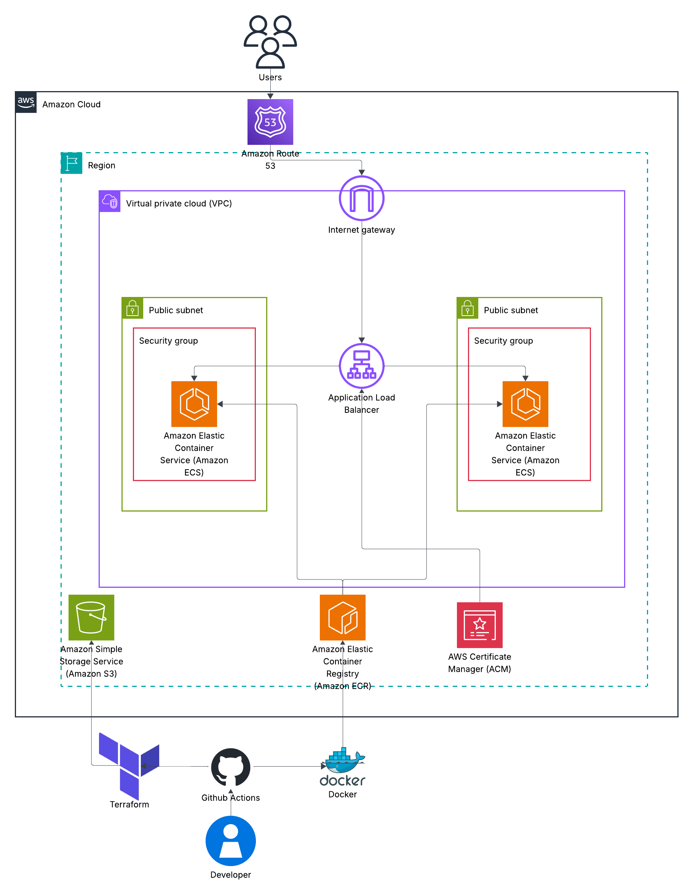
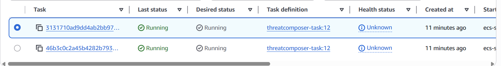
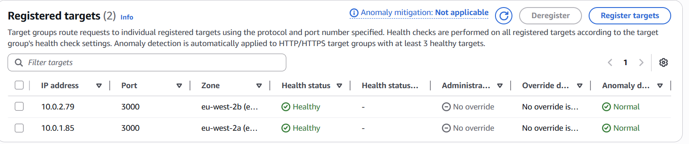
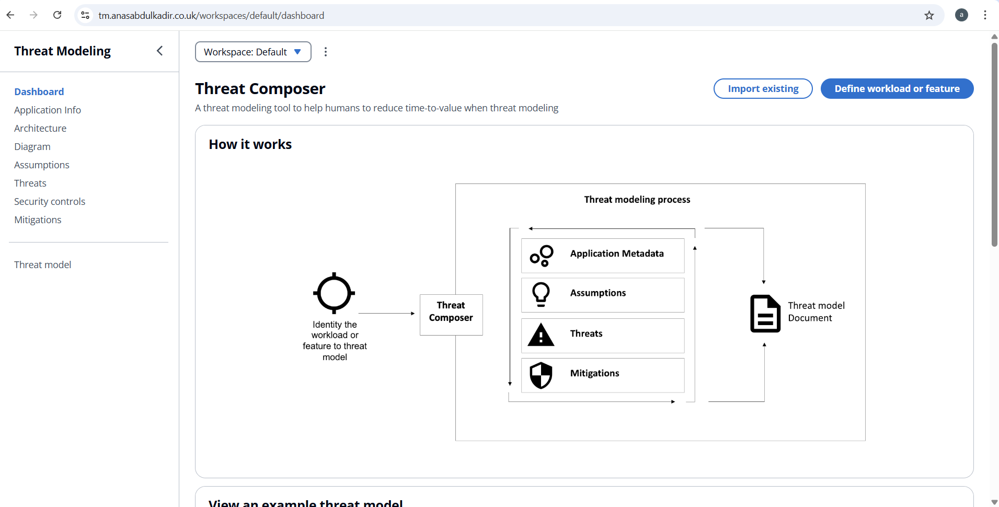

# End-to-End DevOps Deployment on AWS using ECS, Terraform & Docker

This project demonstrates a complete end-to-end DevOps workflow where a containerised application is provisioned and deployed to AWS using Infrastructure as Code (Terraform), Docker, and automated CI/CD pipelines.

The objective of this project was to simulate a production-style AWS environment while maintaining cost efficiency and infrastructure reproducibility.

---

## 📌 Project Overview

This setup provisions and deploys:

- A custom **VPC** with two public subnets across multiple Availability Zones
- An **Internet Gateway** for outbound internet connectivity
- An **Application Load Balancer (ALB)** as the public entry point
- An **ECS Cluster (Fargate)** running Docker containers
- An **ECR repository** for container image storage
- An **S3 remote backend** for Terraform state management
- **Route 53** for DNS routing
- **ACM** for HTTPS/TLS certificate management
- **CloudWatch** for logging and monitoring

The infrastructure is fully provisioned using Terraform and the application is containerised using Docker before being deployed to ECS.

---

## 🏗 Architecture Diagram

The diagram below reflects the final deployed infrastructure.

- Public-only VPC architecture
- Regional AWS services outside the VPC boundary
- ALB as the single public entry point
- ECS tasks running inside public subnets
- Remote state stored in S3



---

##  Repository Structure

```bash

└── ./
    ├── .github
    │   └── workflows
    │       ├── ci.yml
    │       └── cd.yml
    ├── Dockerfile
    ├── Terraform
    │   ├── modules
    │   │   ├── alb/
    │   │   ├── ecs/
    │   │   ├── iam/
    │   │   ├── route53/
    │   │   ├── security-grps/
    │   │   └── vpc/
    │   ├── main.tf
    │   ├── backend.tf
    │   ├── outputs.tf
    │   ├── provider.tf
    │   └── variables.tf
    └── README.md
```

---

## 📸 Deployment Proof

### ECS Service Running


### Target Group Healthy


### Application Live via Custom Domain


---

## ⚙️ Infrastructure Design

### Networking

- Two public subnets across different AZs for high availability
- Route table configured with `0.0.0.0/0` → Internet Gateway
- Security Groups restrict traffic between ALB and ECS tasks
- ALB is the only publicly accessible component

### Compute

- ECS Fargate service running containerised workloads
- Target group health checks configured for availability
- ECS tasks pull container images from ECR

### DNS & HTTPS

- Route 53 hosted zone configured for domain resolution
- ACM certificate attached to ALB for HTTPS
- HTTP to HTTPS redirection enforced

---

## 🐳 Docker Implementation

- Application containerised using Docker
- Image pushed to Amazon ECR
- Optimised image build process
- Designed to be lightweight and portable

---

## 🌍 Terraform Implementation

- Modular infrastructure structure
- Remote backend configured in S3
- State versioning enabled
- Infrastructure fully reproducible using `terraform init` and `terraform apply`

---

## 🚀 CI/CD Pipeline

GitHub Actions automates:

- Docker image build
- Push to ECR
- Terraform validation and planning
- Infrastructure deployment

Sensitive data and credentials are stored securely using GitHub Secrets.

---

## Local app setup 💻

Install dependencies and build the project:

```bash
yarn install
yarn build

```

Start the application locally

```bash
yarn global add serve
serve -s build

```

Access the application at:
http://localhost:3000/workspaces/default/dashboard

---